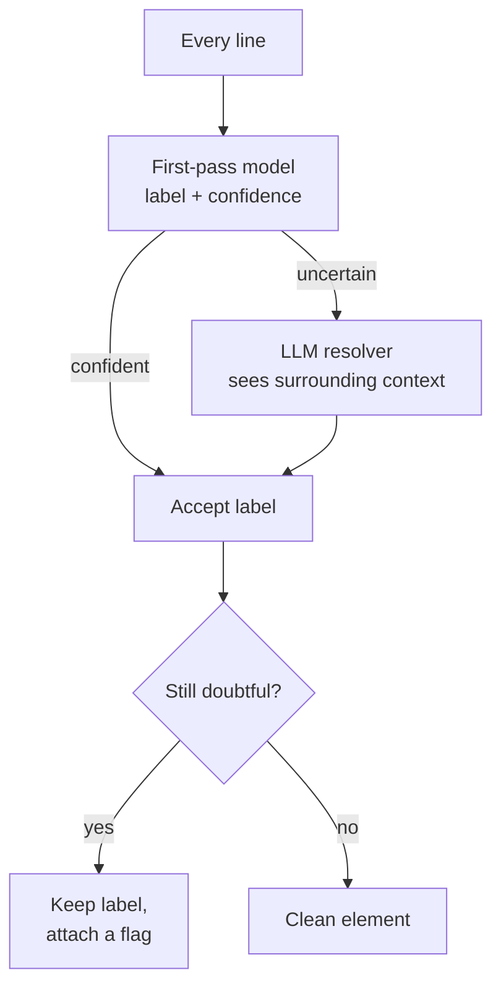
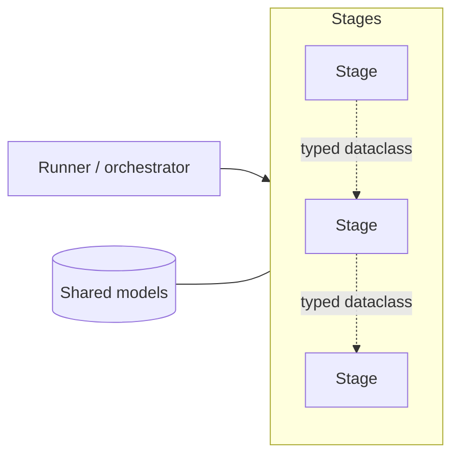
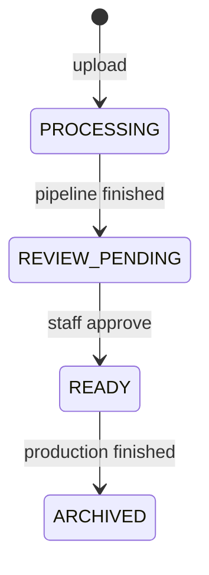
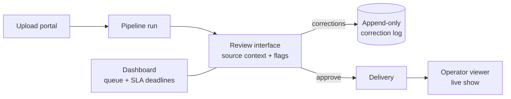

# Screenplay Extractor

**Turning theatre manuscripts into live subtitles, with a human in the loop where it counts.**

Screenplay Extractor reads a manuscript (PDF, DOCX or plain text), works out who says what, and produces a sequential list of subtitle lines that a technician steps through during a live performance. It was built for [Accessible Futures](https://accessiblefutures.se) to make theatre accessible to audiences who need text support, in Swedish and English, with optional translation.

> This repository is a public overview. Prompts, calibration values, evaluation data and customer manuscripts are intentionally not included.

---

## The problem

A theatre script is a messy document. Character names, stage directions, scene headings, songs and dialogue are all mixed together, and every playwright formats them differently. Subtitle operators need clean, correctly attributed, correctly sized lines, and a single wrong speaker or a stage direction shown to the audience breaks the experience.

The goal is not just high accuracy. It is **accuracy you can trust**: when the system is unsure, it says so.

## What it does

| Input | Output |
|---|---|
| Manuscript as PDF, DOCX or TXT (including scanned PDFs via OCR) | Operator line list (JSON), SRT subtitles, optional translated versions, and a run manifest |

```text
CLAIRE                          { "id": 1, "type": "Dialogue",
I thought you were taking  -->    "character": "Claire",
out the garbage.                  "text": "I thought you were taking out the garbage.",
                                  "flags": [] }
(Dylan sits on the steps)  -->  (not shown to the audience)
```

---

## Pipeline at a glance

```mermaid
flowchart LR
    A[Manuscript<br/>PDF · DOCX · TXT] --> B[Input handling<br/>text + font cues,<br/>Unicode normalisation]
    B --> C[Character<br/>extraction]
    C --> D[Fast first-pass<br/>classifier]
    D --> E[LLM resolver<br/>only for uncertain lines]
    E --> F[Post-processing<br/>cleanup · validation · flags]
    F --> G[Translation<br/>optional]
    G --> H[Subtitle<br/>segmentation]
    H --> I[(JSON · SRT<br/>+ manifest)]

    classDef ai fill:#e8f0fe,stroke:#4a6fd8,color:#111
    classDef det fill:#eef7ee,stroke:#4a9a5a,color:#111
    class C,D,E ai
    class B,F,G,H det
```



Blue stages use AI models. Green stages are deterministic code.

### Cascade classification: cheap first, smart when needed

Most lines in a script are easy. Instead of sending everything to a large LLM, a fast specialised model labels every line and reports its confidence. Only the lines it is unsure about are escalated.



Why this shape:

- **Cost and speed.** The expensive model only sees the hard cases.
- **Swappable models.** Provider-specific code is isolated behind narrow seams, so both stages can be replaced by local models without touching the rest of the pipeline.
- **Traceability.** Every run persists the first-pass draft, so any result can be inspected after the fact.

---

## Design principles

### 1. Flag, don't guess
Uncertain output is acceptable if it is *marked*. Wrong output with no flag is treated as a product failure. Flags such as `orphan_dialogue`, `unmatched_speaker` or `lyrics_uncertain` travel with each line into the review interface.

### 2. Typed boundaries between stages
Stages never import each other. They exchange typed dataclasses and a single orchestrator wires them together, which keeps each stage independently testable.



### 3. Reproducibility where it is possible, honesty where it is not
LLM calls run at temperature 0 where supported. Where a model exposes no determinism controls, the project documents the measured run-to-run variation and persists each run's draft so results remain auditable. Regression tests use recorded output and never call live APIs.

### 4. Language-aware by default
Swedish text has multiple Unicode representations for the same character, so everything is normalised once at the boundary. Subtitle segmentation follows broadcast subtitle conventions (line length limits, two-line events, linguistically sensible break points) with language-specific rules for English and Swedish.

---

## From pipeline to production workflow

The pipeline is one half of the system. The other half is a review workflow so staff can correct and approve results before anything reaches a customer.





- **Review interface** shows each element next to its source text and flags, and records every correction by category (wrong type, wrong speaker, split error, and so on).
- **Correction log** is append-only, giving a dataset for measuring and improving the classifier.
- **Dashboard** tracks the queue against standard and urgent delivery tiers.
- **Operator viewer** presents lines for live advancement during a show.

---

## Quality approach

- **Golden-file regression tests** built from manuscripts that were delivered with zero corrections.
- **Invariant checks** in post-processing (for example, no dialogue without a speaker, characters only kept if they actually speak).
- **LLM-as-judge tooling** for evaluating reference labels, paired with a written register of known judge failure modes and how each one is detected.
- **Strict static analysis**: Ruff, mypy with a strict configuration, and a test suite that mirrors the source tree.
- **Structured logging** with per-document context and no manuscript text or secrets in production logs.

---

## Tech stack

| Area | Tools |
|---|---|
| Language & tooling | Python 3.12, uv, Ruff, mypy, pytest |
| Web | FastAPI, Uvicorn, Jinja2 (server-rendered, no JS framework) |
| Data modelling | pydantic v2, dataclasses, versioned JSON Schema |
| Document extraction | pdfplumber, python-docx, Tesseract OCR |
| AI | Anthropic Claude API, a specialised first-pass decision model, DeepL for translation |
| Observability | structlog |

## Repository layout (high level)

```text
src/screenplay_extractor/
    pipeline/    stage modules + versioned prompt builders
    models/      typed domain models
    review/      review business logic and storage
    api/         upload, review, dashboard and viewer routes
    schemas/     versioned output schemas
tests/           mirrors src/
tools/           developer utilities (evaluation, replay)
```

## What I'd highlight

- Designing an **uncertainty-aware** LLM pipeline where flags are a first-class output.
- A **cost-aware cascade** that routes only hard cases to a larger model, built so models can be swapped for local ones.
- A full **human-in-the-loop product** around the pipeline: states, review, audit trail, SLAs.
- Handling **real-world document mess** (fonts, OCR, Swedish text) with typed, testable stages.

---

*Built by Accessible Futures. Contact: see GitHub profile.*
