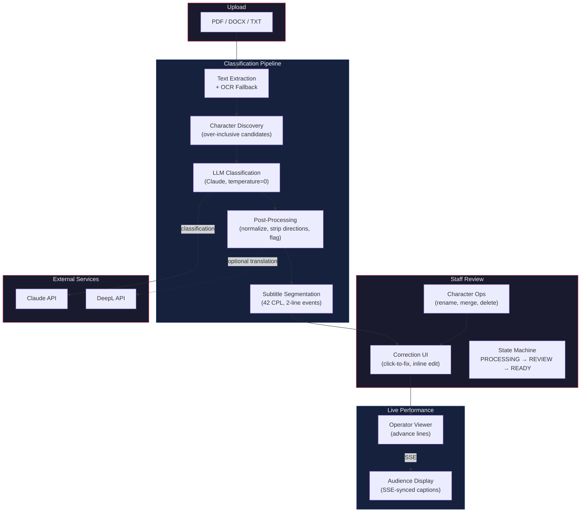
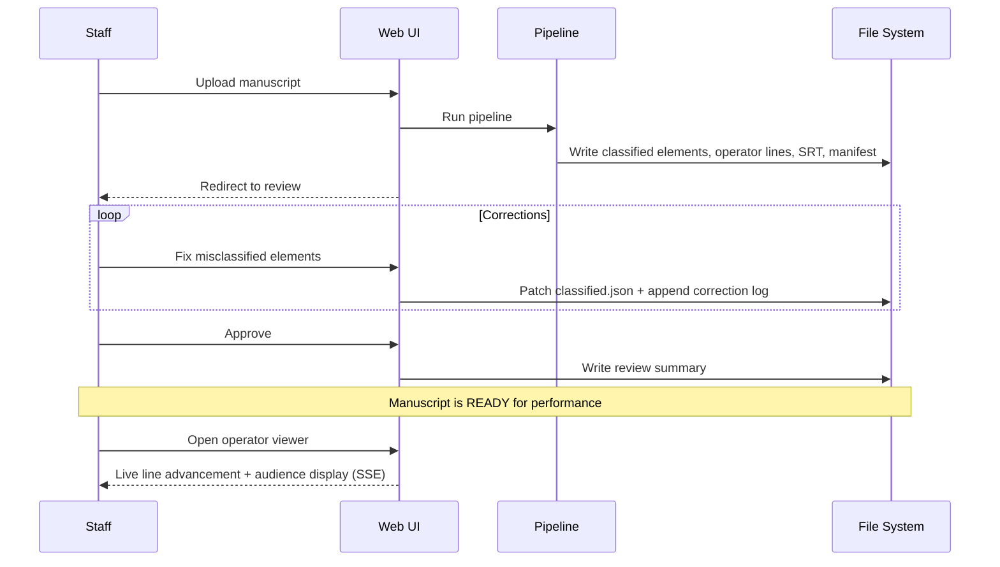

# Screenplay Extractor — Manuscript-to-Subtitle Pipeline

Live theater captioning relies on an operator advancing subtitle lines in sync with actors on stage. But the input — a screenplay manuscript — is an unstructured document full of stage directions, scene headings, metadata, and formatting inconsistencies. Getting from raw PDF to a clean, ordered line list that an operator can actually use requires classification, normalization, and human review.

Screenplay Extractor automates this. It ingests manuscripts (PDF, DOCX, TXT), classifies every line using an LLM, normalizes and flags anomalies, segments dialogue into subtitle-ready chunks, and presents the result for staff review — all through a web interface that handles the full lifecycle from upload to live performance.

Built in Python. Designed for Swedish/English-language theater. Currently in MVP with real manuscripts in processing.

---

## Architecture Overview




---

## Key Design Decisions

### Over-Include, Then Prune

The character discovery stage intentionally generates too many candidates — any uppercase pattern is a potential character name. This means scene headings (`INT. KITCHEN - DAY`), metadata (`SHOOTING DRAFT`), and camera directions (`ANGLE ON HOMER`) all become candidates.

Why not filter these out with regex? Because every manuscript format introduces new uppercase conventions. Adding format-specific rules is whack-a-mole that eventually conflicts across documents.

Instead, the LLM classifier decides what's actually a character vs. structural text. After classification, a pruning pass drops any candidate that never appeared as a speaker in a Cue or Dialogue element. The discoverer stays dumb and broad; the classifier is the authority.

### Flag, Don't Guess

When classification is uncertain, the system adds a flag — it never silently picks the most likely answer. Incorrect output *with* a flag is acceptable; incorrect output *without* a flag is a product failure.

This inverts the usual ML instinct to maximize accuracy. In a human-in-the-loop pipeline, the cost of a silent wrong answer (operator reads the wrong line during a live show) vastly outweighs the cost of flagging something for review. The flag vocabulary is canonical — 15 named flags, each set by a specific stage, never invented ad-hoc.

### Deterministic Pipeline

LLM calls use `temperature=0`. All collections use stable sorting. Same input + same config = same output. This matters for debugging (reproduce the exact run) and for golden-file regression tests (diff the output).

The runner snapshots all behavioral settings into a `manifest.json` per run (excluding secrets), so you can always answer "what config produced this output?"

### Auto-Strip, Keep the Receipt

Inline stage directions like `(to Claire)` buried inside dialogue would bleed through to subtitle output. The post-processor auto-strips these parentheticals, inserts them as separate Parenthetical elements, and sets a `may_contain_inline_direction` flag with metadata recording how many were stripped. Staff sees the flag during review and can verify correctness — the system cleaned up the mess but left a paper trail.

### Subtitle-Aware Segmentation

The chunker follows Netflix/Disney+ subtitle standards: 42 characters per line, 2-line events. Break priority: sentence boundary > clause boundary > comma > conjunction > safe word boundary. The system uses closed-class word lists (articles, prepositions, auxiliaries, pronouns) to avoid splitting syntactic units — never breaking `the dog` or `I'm not` across lines. No NLP model dependency; word lists cover the problem at a fraction of the complexity.

### File-Based Everything

No database. Manuscripts are JSON files, corrections are append-only JSONL, output artifacts live in versioned run directories. This keeps the system deployable without infrastructure, makes debugging trivial (read the files), and gives you version history for free (re-runs create new numbered directories, old manuscripts are archived with `superseded_by` links).

---

## System Design

```
src/screenplay_extractor/
├── config.py        Settings (pydantic-settings, SE_ prefix, .env)
├── logging.py       structlog with contextvars (document_id, pipeline_stage)
├── models/          Typed dataclasses — shared vocabulary across all layers
├── pipeline/        Isolated stages + runner orchestrator + versioned prompts
├── review/          State machine + correction logic (service) / file I/O (storage)
├── api/             FastAPI, Jinja2 templates, vanilla CSS/JS — no framework
└── schemas/         Versioned JSON Schema contracts (immutable once published)
```

Each pipeline stage is a standalone module with a single public function. Stages never import each other — the runner is the only module that wires them together. This means any stage can be tested, replaced, or rewritten without touching the rest of the pipeline.

The web layer is deliberately thin: route handlers delegate to `review.service` for business logic and `pipeline.runner` for processing. Templates are server-rendered Jinja2 with no JS framework — the operator viewer uses vanilla JS + Server-Sent Events for real-time sync between control and audience displays.

---

## Data Flow




---

## Technical Highlights

- **LLM classification with structured output** — Claude classifies lines into 8 element types with character attribution; responses parsed as JSON with fallback flagging on parse failure
- **Multi-pass post-processing** — normalize characters (3-tier: exact match → variant recovery → flag), strip inline directions, check invariants, clean subtitle-unsafe symbols — each pass independently testable
- **Dialogue merge before segmentation** — consecutive same-speaker dialogue lines (split across PDF lines) are merged before chunking to produce natural subtitle events
- **OCR pipeline** — Tesseract fallback for image-only PDFs with pipe-character stripping, no-alpha line filtering, and parameterized header detection (template-matching for headers with embedded page numbers)
- **Append-only correction log** — every staff edit is recorded as a JSONL entry with category, timestamp, and before/after state; enables future data-driven automation (Phase 3 roadmap)
- **Operator viewer** — dual-view SSE architecture: operator advances lines on a control display, audience display follows in real time via server-sent events
- **Versioned everything** — prompts, output schemas, and run artifacts are versioned; published schemas are never mutated

---

## Tech Stack


| Layer              | Technology                               |
| ------------------ | ---------------------------------------- |
| Language           | Python 3.12                              |
| Package management | uv (lockfile committed)                  |
| Web                | FastAPI + Uvicorn, Jinja2, vanilla JS    |
| Validation         | pydantic v2, pydantic-settings           |
| LLM                | Anthropic Claude API                     |
| Translation        | DeepL API                                |
| PDF extraction     | pdfplumber + pytesseract (OCR fallback)  |
| DOCX extraction    | python-docx                              |
| Logging            | structlog (structured, contextvar-bound) |
| Testing            | pytest + pytest-asyncio, httpx           |
| Linting            | Ruff (lint + format), mypy (strict)      |


---

## Status

In use — processing real Swedish theater manuscripts with staff review. Pipeline, review system, and operator viewer are functional.

---

*Built as part of an accessibility initiative to bring real-time captioning to Swedish-language theater.*

Built by Dahni Strauss at [Accessible Futures AB](https://accessiblefutures.se).